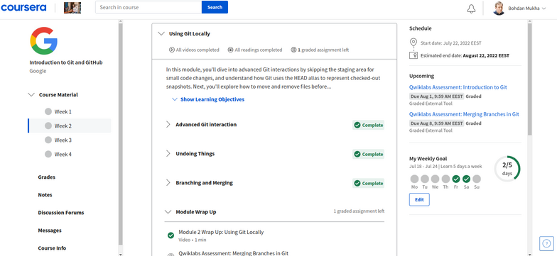
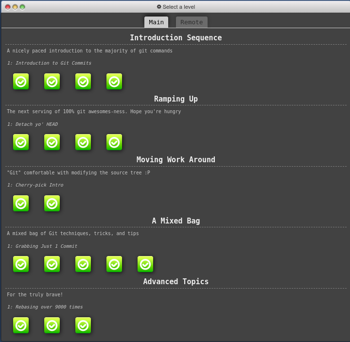
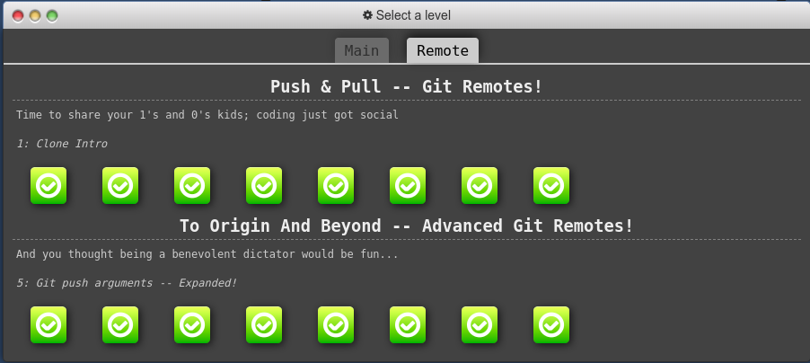

# Repo for tracking my journey on Stage 0 of [kottans-frontend](https://github.com/kottans/frontend) course

###### \*Content is structured in reversed chronological order (from bottom to top).

---

General

 

0. Git basics

 

Though I have worked with Git before, I've used only basic push and pool commands. So, basically, everything was new for me in this course. The thing that impressed me the most is the sheer amount of possibilities that GIT provides. I will definitely use rebasing, merging and cherry-picking in the future.

