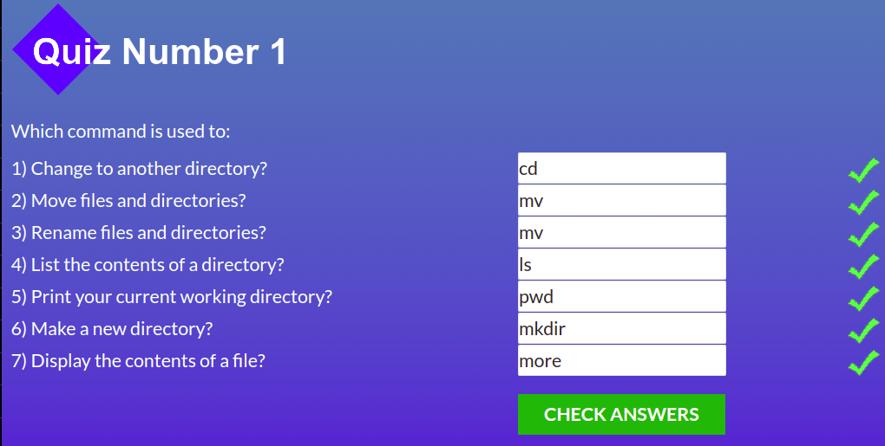
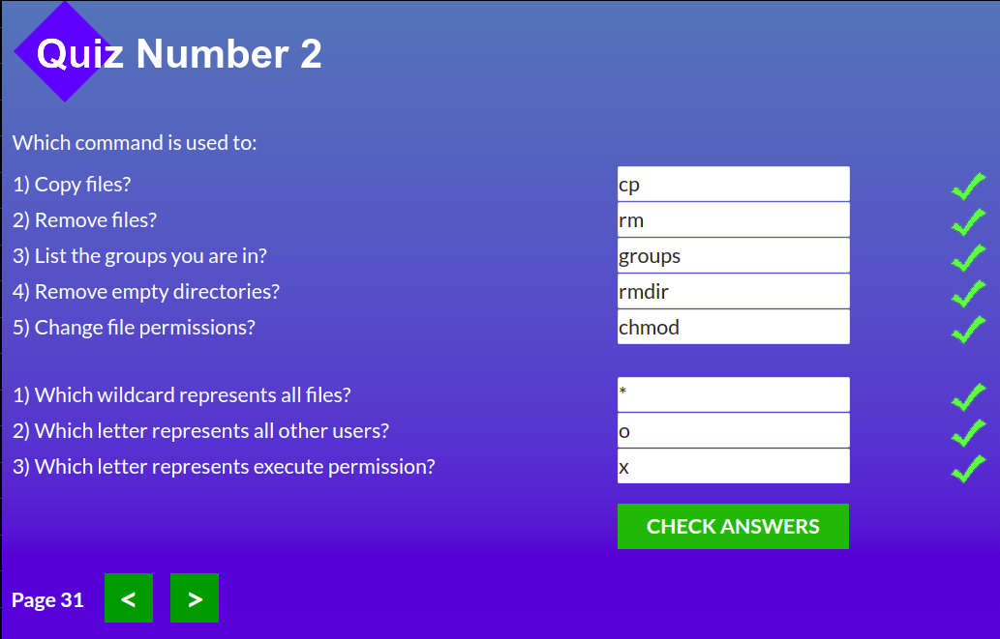
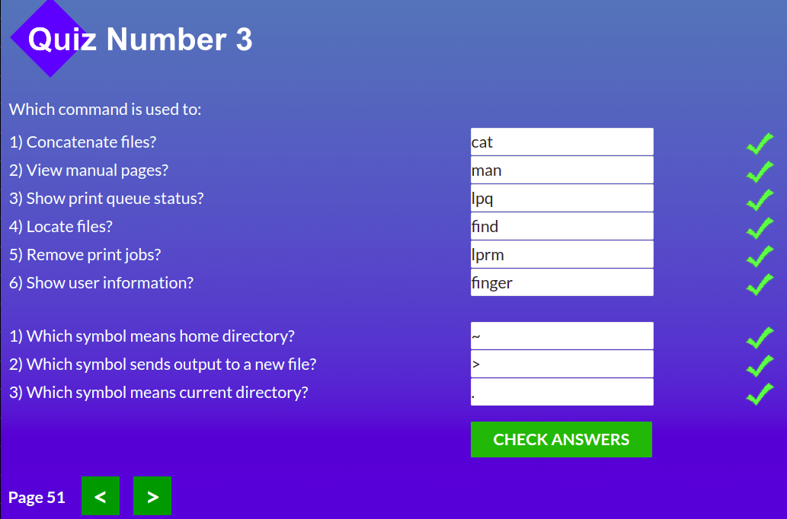
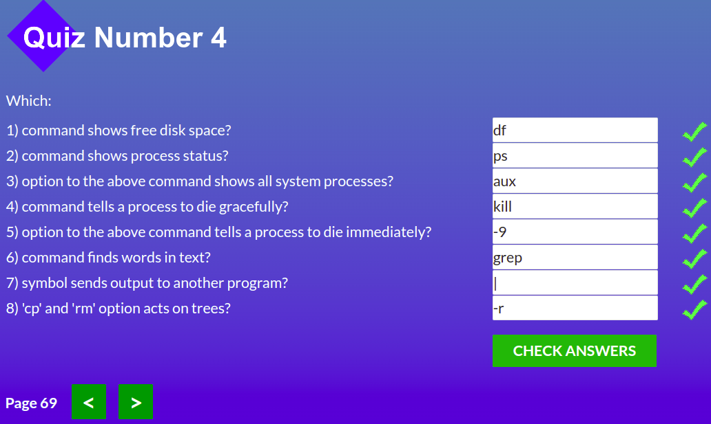
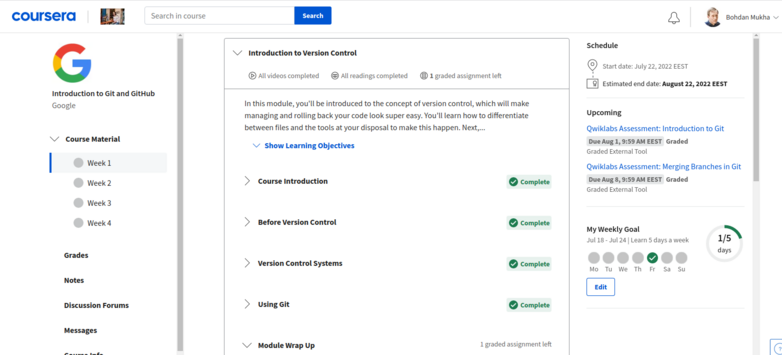
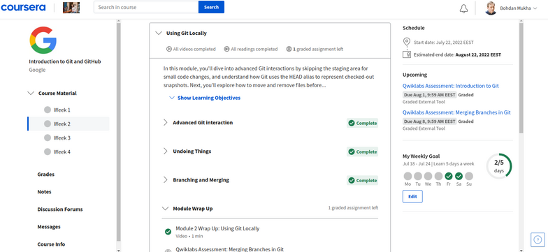
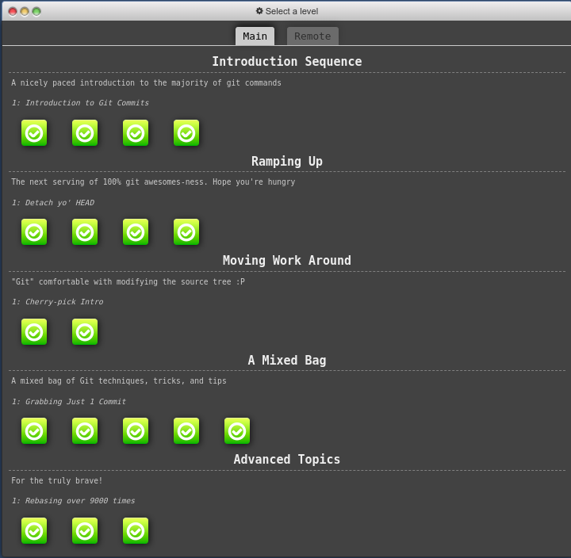

# Repo for tracking my journey on Stage 0 of [kottans-frontend](https://github.com/kottans/frontend) course

###### \*Content is structured in reversed chronological order (from bottom to top).

---

1. Linux CLI, and HTTP

 

Despite being Linux user for quite some time, I've always used GUI to manipulate stuff. Surprisingly, it looks like console can make some of my routines even quicker. I will definitely try to use console more. As for HTTP part of the course - everything was new for me. And yep, I'm definitely going to use HTTP in the future! :wink:

0. Git basics

 

Though I have worked with Git before, I've used only basic push and pool commands. So, basically, everything was new for me in this course. The thing that impressed me the most is the sheer amount of possibilities that GIT provides. I will definitely use rebasing, merging and cherry-picking in the future.

