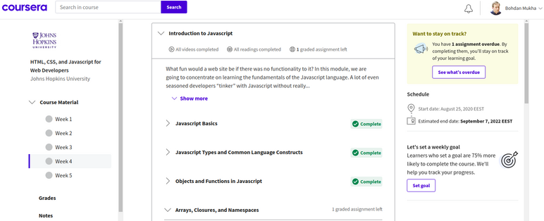

# Repo for tracking my journey on Stage 0 of [kottans-frontend](https://github.com/kottans/frontend) course

###### \*Content is structured in reversed chronological order (from bottom to top).

---

6. JS Basics

 

This chapter took me a couple days to complete because of weekend and whatnot. Intro to JS from John Hopkins University is a bit outdated, but I brushed up my knowledge of basics regardless. And in the process of doing tasks on FreeCodeCamp I have solidified my understanding of functional programming and familiarized myself with couple useful array and string methods I have never used before.

5. HTML-CSS-Popup(not done yet)

 

4. Responsive Web Design

 

Everything was new for me here, and sheer amount of ways you can do stuff with grid is definitely surprising, if not to say terrifying, lol ) But I had a lot of fun with froggies and garden though.

3. Intro to HTML and CSS

 

A lot of new things in this one, to be honest. Though I've had some previous familiarity with CSS, basically all of the Typography stuff was new and sometimes surprising for me. But I can definitely see how usefull this knowledge can be in the future.

2. Git Collaboration

 

Basically all the collaboration stuff was new for me. I can't say anything was particularly surprising, but all those fancy workflows definitely will be useful during my future day-to-day working process.

1. Linux CLI, and HTTP

 

Despite being Linux user for quite some time, I've always used GUI to manipulate stuff. Surprisingly, it looks like console can make some of my routines even quicker. I will definitely try to use console more. As for HTTP part of the course - everything was new for me. And yep, I'm definitely going to use HTTP in the future! :wink:

0. Git basics

 

Though I have worked with Git before, I've used only basic push and pool commands. So, basically, everything was new for me in this course. The thing that impressed me the most is the sheer amount of possibilities that GIT provides. I will definitely use rebasing, merging and cherry-picking in the future.

